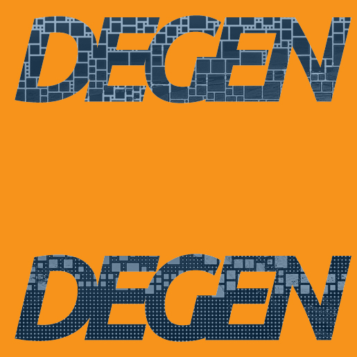
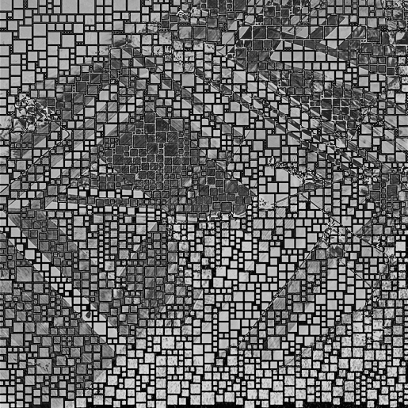
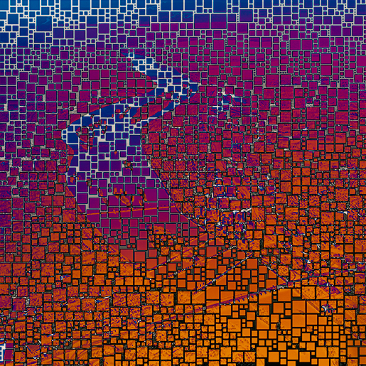
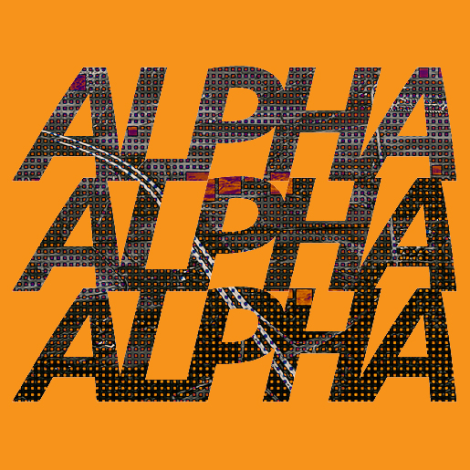

# Bitmap City Vol. 2

## Bitmap City Vol. 2

_Bitmap City Vol. 2_ is a pioneering generative fine art collection within Digital Matter Theory (DMT), redefining fine art on Bitcoin’s blockchain. Each piece fuses high-resolution photography, bitmap blocks, Pantone colors, and web3 slang. By leveraging the Merkle root embedded in Bitcoin’s blockchain data, the artwork is algorithmically assembled and created, showcasing the intersection of fine art + technology.

<figure><figcaption></figcaption></figure> <figure><figcaption></figcaption></figure> <figure><figcaption></figcaption></figure> <figure><figcaption></figcaption></figure> <figure><figcaption></figcaption></figure> <figure><figcaption></figcaption></figure>

***

### Artistic Vision

_Bitmap City Vol. 2_ aims to seamlessly merge digital and physical landscapes by carefully juxtaposing the digital topography of bitmaps with the analogous terrains of cities, towns, and farms. Utilizing non-arbitrary data sets, meticulously chosen colors, and Web3 slang, the collection creates a unified space where three worlds coalesce into one—wholly digital, wholly human, and a shared, in-between space. Every element is intentional, blurring the boundaries between the digital and the physical, transforming them into a singular, cohesive narrative.

***

### Why DMT?&#x20;

[Digital Matter Theory](https://digital-matter-theory.gitbook.io/digital-matter-theory) proposes that it's possible to create a form of digital substance by harnessing the inherent patterns within data. Without building this collection within the DMT framework, achieving the pristine quality of non-arbitrary data would be unattainable, making the vision of bridging two worlds impossible.&#x20;

***

### Acknowledgments

Bitmap City Vol. 2 was created by [CRFTD](https://x.com/_CRFTD_).

[DMT](https://digital-matter-theory.gitbook.io/digital-matter-theory) was introduced by [The Block Runner](https://x.com/TheBlockRunner) team.

Thanks to the crew at [Scarce.City](https://x.com/scarcedotcity) for backend help in making Bitmap City Vol. 2 come alive on the blockchain.

Thanks to [Natcats](https://natcats.gitbook.io/natcats) and [EV](https://x.com/Evonbit) for introducing us to DMT PFP collections and showing what is possible.
