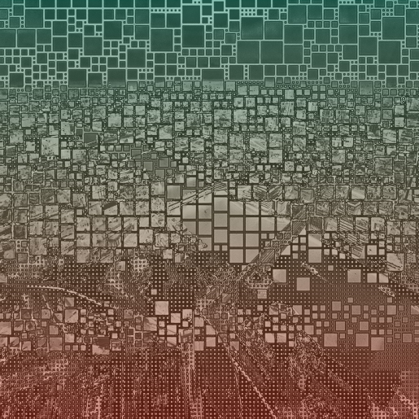

# Bitmap City Vol. 2

## Bitmap City Vol. 2

_Bitmap City Vol. 2_ is the first collection of its kind, merging fine art with generative art through the framework of Digital Matter Theory (DMT). Each piece fuses high-resolution photography, bitmap blocks, Pantone colors, and web3 slang. By leveraging the Merkle root embedded in Bitcoin’s blockchain data, the differing layers of fine art are algorithmically randomized, assembled, and fused, creating the final generated artwork.

<figure><figcaption></figcaption></figure> <figure><figcaption></figcaption></figure> <figure><figcaption></figcaption></figure> <figure><figcaption></figcaption></figure> <figure><figcaption></figcaption></figure> <figure><figcaption></figcaption></figure>

***

### Artistic Vision

The artistic vision for _Bitmap City Vol. 2_ is to redefine fine art by bridging traditional, fine art practices with cutting-edge blockchain technology. By leveraging Digital Matter Theory (DMT), the collection explores the intersection of physical and digital spaces, using photography as its foundation while incorporating bitmap blocks, Pantone colors, and web3 slang. It seeks to create a third, shared space where the tangible (fully human art) and the virtual (fully digital framework) coexist, challenging perceptions of fine art and inviting viewers to reflect on the evolving relationship between humanity, technology, and art.

***

### Why DMT?&#x20;

[Digital Matter Theory](https://digital-matter-theory.gitbook.io/digital-matter-theory) proposes that it's possible to create a form of digital substance by harnessing the inherent patterns within data. Without building this collection within the DMT framework, achieving the pristine quality of non-arbitrary data would be unattainable, making the vision of bridging two worlds impossible.&#x20;

***

### Acknowledgments

Bitmap City Vol. 2 was created by [CRFTD](https://x.com/_CRFTD_).

[DMT](https://digital-matter-theory.gitbook.io/digital-matter-theory) was introduced by [The Block Runner](https://x.com/TheBlockRunner) team.

Thanks to the crew at [Scarce.City](https://x.com/scarcedotcity) for backend help in making Bitmap City Vol. 2 come alive on the blockchain.

Thanks to [Natcats](https://natcats.gitbook.io/natcats) and [EV](https://x.com/Evonbit) for introducing us to DMT PFP collections and showing what is possible.
