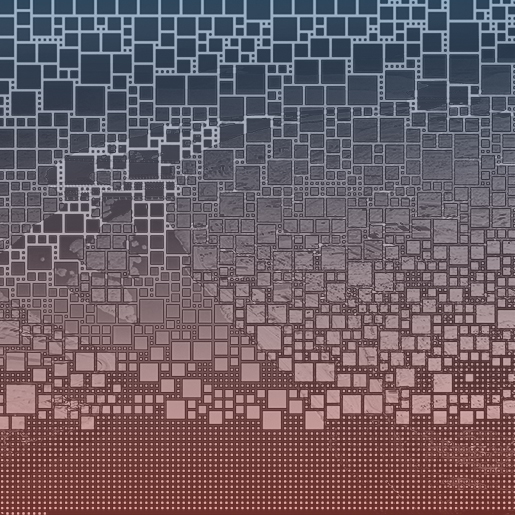

# Collections Within Collection

## Defining terms:

* **Base Art:** Photography and Bitmap
* **Solid Color:** Pantone solid colors from 2009 to 2024
* **Gradient Color:** Pantone gradients from 2009 to 2024
* **Web3:** Slang words

#### Sample of Differing Sets:

* Base art Color
* Base art B\&W
* Base art Color + B\&W
* Base art + Solid Color
* Base art Color + Solid Color
* Base art B\&W + Solid Color
* Base art + Gradient Color 90°
* Base art Color + Gradient Color 90°
* Base art B\&W + Gradient Color 90°
* Base art + Gradient Color 180°
* Base art Color + Gradient Color 180°
* Base art B\&W + Gradient Color 180°
* Base art + Solid Color + Web3
* Base art Color + Solid Color + Web3
* Base art B\&W + Solid Color + Web3
* Base art + Gradient Color 90° + Web3
* Base art Color + Gradient Color 90° + Web3
* Base art B\&W + Gradient Color 90° + Web3
* Base art + Gradient Color 180° + Web3
* Base art Color + Gradient Color 180° + Web3
* Base art B\&W + Gradient Color 180° + Web3
* Base art Color + Web3
* Base art B\&W + Web3
* Base art + Web3

#### There is also the option to collect a single layer exclusively, which increases the number of possible sets.

Example of Base art Color

<figure><figcaption></figcaption></figure>

 

<figure><figcaption></figcaption></figure>

 

<figure><figcaption></figcaption></figure>

 

<figure><figcaption></figcaption></figure>

Example of Base art B\&W + Gradient Color 90° (single image for base art)

<figure><figcaption></figcaption></figure>

 

<figure><figcaption></figcaption></figure>

 

<figure><figcaption></figcaption></figure>

 

<figure><figcaption></figcaption></figure>

Example of Base art Color + Web3

<figure><figcaption></figcaption></figure>

 

<figure><figcaption></figcaption></figure>

 

<figure><figcaption></figcaption></figure>

 

<figure><figcaption></figcaption></figure>

