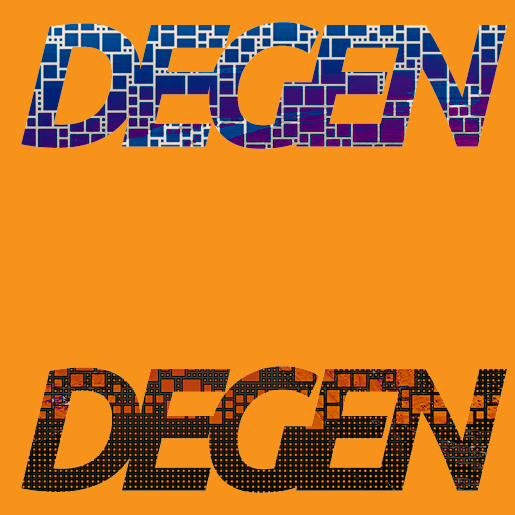
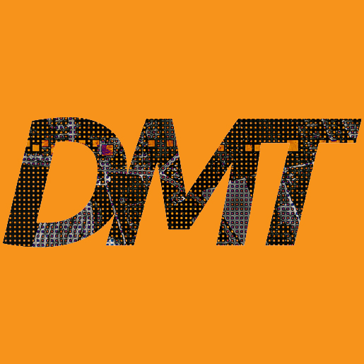
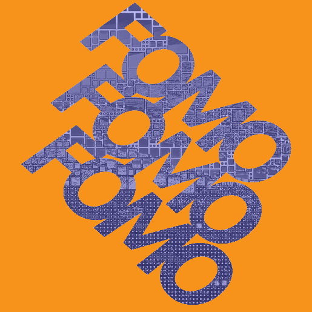
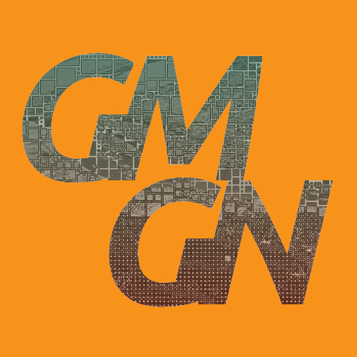
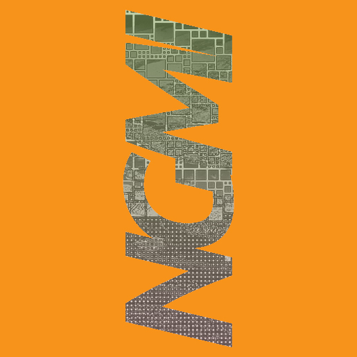
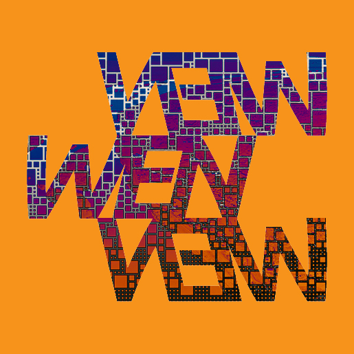

# Layered Artwork

### **Layer 1 (bottom layer)**

#### High-Resolution Photography

Aerial photography was captured inside of a propeller plane using a Canon R5c and Canon L series lenses. Flying altitudes ranged from 5,000 to 10,000 feet to provide ample variations in the topography of cities, towns, and farmland. Inside major cities, photos were captured from skyscrapers. The high-resolution photography forms the foundation of each artwork, bringing a tangible element to the digital space. There are a total of 25 color photographs and 25 B\&W photographs for a base layer of 50.

#### Bitmap Blocks

Blocks were chosen for their varying formations, historical significance, and digital counterparts to the physical captures. These "digital cities" pair with the landscape photography to represent a meshing of the physical and digital. Bitmap blocks also provide a grounding of the artwork visually, linking it to Bitcoin’s immutable legacy.

 

***

### Layer 2 (middle layer)

#### Pantone Colors

The choice to utilize Pantone’s Colors of the Year as the color palette was an intentional decision to mimic DMT's non-arbitrary nature. The colors are set, one for each year, and will forever be the same. They serve as a connection to the cultural zeitgeist of the past 15 years and tie the collection to significant moments in time, adding depth and resonance to the pieces. 2009 was chosen as the starting year, the same year that birthed Bitcoin:

<figure><figcaption></figcaption></figure>

**Solid colors**

2009 Mimosa\
2010 Turquoise\
2011 Honeysuckle\
2012 Tangerine Tango\
2013 Emerald\
2014 Radiant Orchid\
2015 Marsala\
2016 Rose Quartz\
2016 Serenity\
2017 Greenery\
2018 Ultra Violet\
2019 Living Coral\
2020 Classic Blue\
2021 Illuminating\
2021 Ultimate Gray\
2022 Very Peri\
2023 Viva Magenta\
2024 Peach Fuzz

Examples of Layer 1 + Layer 2 (solid colors)

 

<figure><figcaption></figcaption></figure>

 

<figure><figcaption></figcaption></figure>

<figure><figcaption></figcaption></figure>

 

<figure><figcaption></figcaption></figure>

 

<figure><figcaption></figcaption></figure>

**Gradients from year to year**&#x20;

2009-2010\
2010-2011\
2011-2012\
2012-2013\
2013-2014\
2014-2015\
2015-2016A\
2015-2016B\
2016A-2017\
2016B-2017\
2017-2018\
2018-2019\
2019-2020\
2020-2021A\
2020-2021B\
2021A-2022\
2021B-2022\
2022-2023\
2023-2024

Within the set of gradients, two varying directions were chosen, 90° and 180°, to represent upward and forward momentum, or an "Up Only" attitude.

Examples of Layer 1 + Layer 2 (gradient colors)

 

***

## Layer 3 (top layer)

### Web3 Slang

A layer of contemporary web3 slang is woven into many of the pieces, engaging with the digital culture that surrounds the blockchain space and adds a conceptual twist.

Examples of Layer 1 + Layer 2 + Layer 3

<figure><figcaption></figcaption></figure>

 

<figure><figcaption></figcaption></figure>

 

<figure><figcaption></figcaption></figure>

 

<figure><figcaption></figcaption></figure>

 

<figure><figcaption></figcaption></figure>

 

<figure><figcaption></figcaption></figure>

 

<figure><figcaption></figcaption></figure>

